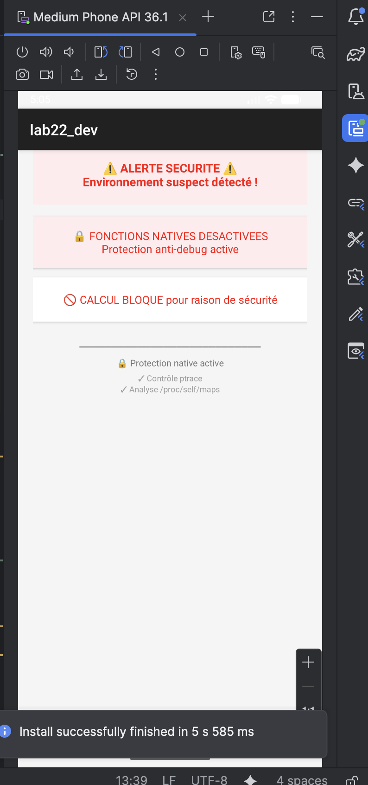

# LAB 23 – JNI + Protection Anti-Debug native 🛡️

## Aperçu de l'application

Une application Android intégrant une couche de sécurité native en C/C++ via JNI. L'application exécute deux contrôles défensifs côté natif (ptrace et inspection de /proc/self/maps) pour détecter un environnement suspect (débogueur attaché ou bibliothèques d'instrumentation chargées). En fonction du résultat, l'interface adapte son comportement.

| Écran sécurisé  |
|------------------------|
|  | 

## Fonctionnalités

- **Détection anti-debug native** : contrôle via `ptrace(PTRACE_TRACEME)`
- **Inspection mémoire** : analyse de `/proc/self/maps` pour détecter Frida, Xposed, gdbserver, Magisk
- **Réaction adaptative** : mode normal ou mode dégradé selon l'environnement
- **Journalisation native** : logs dans Logcat avec tag `ANTI_DEBUG_LAB23`
- **Message de bienvenue natif** : chaîne retournée depuis le code C++
- **Calcul factoriel natif** : opération sensible bloquée en cas de détection

## Structure du projet

```
lab23_dev/
├── app/src/main/
│   ├── java/com.example.lab23_dev/
│   │   └── MainActivity.java
│   ├── cpp/
│   │   ├── native-lib.cpp
│   │   └── CMakeLists.txt
│   └── res/
│       └── layout/
│           └── activity_main.xml
```

## Architecture logicielle

```
┌─────────────────────────────────────────────────────────────┐
│                    MainActivity.java                         │
│  static { System.loadLibrary("native-lib"); }               │
│  - isUnderInspection() → boolean                             │
│  - getNativeData() → String                                  │
│  - calculateFactorial(int n) → int                          │
└────────────────────────────┬────────────────────────────────┘
                             │ JNI
                             ▼
┌─────────────────────────────────────────────────────────────┐
│                    native-lib.cpp                            │
│  ┌──────────────────────────────────────────────────────┐   │
│  │  detectTracer() → ptrace(PTRACE_TRACEME)            │   │
│  ├──────────────────────────────────────────────────────┤   │
│  │  findHookingLibraries() → /proc/self/maps           │   │
│  │    recherche: frida, xposed, gdb, magisk...         │   │
│  ├──────────────────────────────────────────────────────┤   │
│  │  isUnderInspection() → JNI_TRUE / JNI_FALSE         │   │
│  └──────────────────────────────────────────────────────┘   │
└─────────────────────────────────────────────────────────────┘
```

## Code source complet

### 1. CMakeLists.txt – Configuration native

**Chemin :** `app/src/main/cpp/CMakeLists.txt`

```cmake
cmake_minimum_required(VERSION 3.22.1)

project("lab23_dev")

add_library(
        native-lib
        SHARED
        native-lib.cpp)

find_library(
        log-lib
        log)

target_link_libraries(
        native-lib
        ${log-lib})
```

### 2. native-lib.cpp – Logique défensive native

**Chemin :** `app/src/main/cpp/native-lib.cpp`

```cpp
#include <jni.h>
#include <string>
#include <cstring>
#include <cstdio>
#include <cstdlib>
#include <android/log.h>
#include <sys/ptrace.h>
#include <unistd.h>

#define LOG_TAG "ANTI_DEBUG_LAB23"
#define LOGI(...) __android_log_print(ANDROID_LOG_INFO, LOG_TAG, __VA_ARGS__)
#define LOGW(...) __android_log_print(ANDROID_LOG_WARN, LOG_TAG, __VA_ARGS__)
#define LOGE(...) __android_log_print(ANDROID_LOG_ERROR, LOG_TAG, __VA_ARGS__)

// Contrôle 1 : Détection de débogueur
static bool detectTracer() {
    long ptraceResult = ptrace(PTRACE_TRACEME, 0, 0, 0);
    if (ptraceResult == -1) {
        LOGE(">>> ALERTE: Processus trace ou debogue <<<");
        return true;
    }
    LOGI("Check ptrace: aucun traceur detecte");
    return false;
}

// Contrôle 2 : Inspection mémoire /proc/self/maps
static bool findHookingLibraries() {
    FILE* mapsFile = fopen("/proc/self/maps", "r");
    if (!mapsFile) {
        LOGW("Impossible de lire /proc/self/maps");
        return false;
    }

    char buffer[1024];
    const char* blacklist[] = {
        "frida", "xposed", "libfrida", "gdbserver",
        "libgdb", "magisk", "substrate", "cydia"
    };
    int blacklistSize = 8;

    while (fgets(buffer, sizeof(buffer), mapsFile)) {
        for (int i = 0; i < blacklistSize; i++) {
            if (strstr(buffer, blacklist[i])) {
                LOGE(">>> BIBLIOTHEQUE SUSPECTE TROUVEE: %s", blacklist[i]);
                fclose(mapsFile);
                return true;
            }
        }
    }

    fclose(mapsFile);
    LOGI("Check maps: aucune bibliotheque suspecte");
    return false;
}

// Méthode JNI principale de détection
extern "C"
JNIEXPORT jboolean JNICALL
Java_com_example_lab23_1dev_MainActivity_isUnderInspection(
        JNIEnv* env,
        jobject /* this */) {

    bool tracerFound = detectTracer();
    bool hookLibFound = findHookingLibraries();

    if (tracerFound || hookLibFound) {
        LOGE("=== ENVIRONNEMENT NON SECURISE DETECTE ===");
        return JNI_TRUE;
    }

    LOGI("=== ENVIRONNEMENT SECURISE ===");
    return JNI_FALSE;
}

// Méthode JNI - Message de bienvenue
extern "C"
JNIEXPORT jstring JNICALL
Java_com_example_lab23_1dev_MainActivity_getNativeData(
        JNIEnv* env,
        jobject /* this */) {
    return env->NewStringUTF("Message depuis le code natif C++!");
}

// Méthode JNI - Calcul factoriel
extern "C"
JNIEXPORT jint JNICALL
Java_com_example_lab23_1dev_MainActivity_calculateFactorial(
        JNIEnv* env,
        jobject /* this */,
        jint value) {

    if (value < 0) {
        return -1;
    }

    long long factResult = 1;
    for (int i = 1; i <= value; i++) {
        factResult *= i;
    }

    return static_cast<jint>(factResult);
}
```

### 3. Layout – activity_main.xml

**Chemin :** `app/src/main/res/layout/activity_main.xml`

```xml
<?xml version="1.0" encoding="utf-8"?>
<ScrollView xmlns:android="http://schemas.android.com/apk/res/android"
    android:layout_width="match_parent"
    android:layout_height="match_parent"
    android:background="#F5F5F5">

    <LinearLayout
        android:layout_width="match_parent"
        android:layout_height="wrap_content"
        android:orientation="vertical"
        android:padding="20dp"
        android:gravity="center_horizontal">

        <TextView
            android:layout_width="match_parent"
            android:layout_height="wrap_content"
            android:text="LAB 23 - JNI Anti-Debug"
            android:textSize="24sp"
            android:textStyle="bold"
            android:textColor="#37474F"
            android:gravity="center"
            android:paddingBottom="20dp" />

        <TextView
            android:id="@+id/security_status"
            android:layout_width="match_parent"
            android:layout_height="wrap_content"
            android:text="Vérification en cours..."
            android:textSize="16sp"
            android:textStyle="bold"
            android:gravity="center"
            android:padding="20dp"
            android:layout_marginBottom="16dp"
            android:background="#E3F2FD"
            android:minHeight="80dp" />

        <TextView
            android:id="@+id/native_message"
            android:layout_width="match_parent"
            android:layout_height="wrap_content"
            android:text="Chargement..."
            android:textSize="15sp"
            android:gravity="center"
            android:padding="15dp"
            android:layout_marginBottom="12dp"
            android:background="#FFFFFF"
            android:elevation="2dp"
            android:minHeight="70dp" />

        <TextView
            android:id="@+id/factorial_result"
            android:layout_width="match_parent"
            android:layout_height="wrap_content"
            android:text="Calcul en attente..."
            android:textSize="15sp"
            android:gravity="center"
            android:padding="15dp"
            android:background="#FFFFFF"
            android:elevation="2dp"
            android:minHeight="60dp" />

        <TextView
            android:layout_width="match_parent"
            android:layout_height="wrap_content"
            android:text="━━━━━━━━━━━━━━━━━━━━━━━━━━━━"
            android:textSize="12sp"
            android:gravity="center"
            android:paddingTop="25dp"
            android:textColor="#9E9E9E" />

        <TextView
            android:layout_width="match_parent"
            android:layout_height="wrap_content"
            android:text="🔒 Protection native active"
            android:textSize="12sp"
            android:gravity="center"
            android:paddingTop="5dp"
            android:textColor="#757575" />

        <TextView
            android:layout_width="match_parent"
            android:layout_height="wrap_content"
            android:text="✓ Contrôle ptrace\n✓ Analyse /proc/self/maps"
            android:textSize="11sp"
            android:gravity="center"
            android:paddingTop="5dp"
            android:textColor="#9E9E9E" />

    </LinearLayout>
</ScrollView>
```

### 4. MainActivity.java – Interface utilisateur

**Chemin :** `app/src/main/java/com/example/lab23_dev/MainActivity.java`

```java
package com.example.lab23_dev;

import androidx.appcompat.app.AppCompatActivity;
import android.graphics.Color;
import android.os.Bundle;
import android.widget.TextView;

public class MainActivity extends AppCompatActivity {

    // Méthodes natives
    public native boolean isUnderInspection();
    public native String getNativeData();
    public native int calculateFactorial(int n);

    static {
        System.loadLibrary("native-lib");
    }

    @Override
    protected void onCreate(Bundle savedInstanceState) {
        super.onCreate(savedInstanceState);
        setContentView(R.layout.activity_main);

        TextView securityTextView = findViewById(R.id.security_status);
        TextView messageTextView = findViewById(R.id.native_message);
        TextView factorialTextView = findViewById(R.id.factorial_result);

        boolean isCompromised = isUnderInspection();

        if (isCompromised) {
            // Mode ALERTE
            securityTextView.setText("⚠️ ALERTE SECURITE ⚠️\nEnvironnement suspect détecté !");
            securityTextView.setTextColor(Color.RED);
            securityTextView.setBackgroundColor(Color.parseColor("#FFEBEE"));

            messageTextView.setText("🔒 FONCTIONS NATIVES DESACTIVEES\nProtection anti-debug active");
            messageTextView.setTextColor(Color.RED);
            messageTextView.setBackgroundColor(Color.parseColor("#FFEBEE"));

            factorialTextView.setText("🚫 CALCUL BLOQUE pour raison de sécurité");
            factorialTextView.setTextColor(Color.RED);
        } else {
            // Mode NORMAL
            securityTextView.setText("✅ SECURITE OK ✅\nAucune anomalie détectée");
            securityTextView.setTextColor(Color.parseColor("#2E7D32"));
            securityTextView.setBackgroundColor(Color.parseColor("#E8F5E9"));

            messageTextView.setText(getNativeData());
            messageTextView.setTextColor(Color.parseColor("#1565C0"));
            messageTextView.setBackgroundColor(Color.parseColor("#E3F2FD"));

            int factorialResult = calculateFactorial(10);
            factorialTextView.setText("📊 Calcul factoriel (10!) = " + factorialResult);
            factorialTextView.setTextColor(Color.parseColor("#1565C0"));
        }
    }
}
```

### 5. build.gradle (Module app)

**Chemin :** `app/build.gradle`

```gradle
plugins {
    id 'com.android.application'
}

android {
    namespace 'com.example.lab23_dev'
    compileSdk 34

    defaultConfig {
        applicationId "com.example.lab23_dev"
        minSdk 24
        targetSdk 34
        versionCode 1
        versionName "1.0"

        testInstrumentationRunner "androidx.test.runner.AndroidJUnitRunner"
        
        externalNativeBuild {
            cmake {
                cppFlags "-std=c++17"
            }
        }
    }

    buildTypes {
        release {
            minifyEnabled false
            proguardFiles getDefaultProguardFile('proguard-android-optimize.txt'), 'proguard-rules.pro'
        }
    }
    
    compileOptions {
        sourceCompatibility JavaVersion.VERSION_1_8
        targetCompatibility JavaVersion.VERSION_1_8
    }
    
    externalNativeBuild {
        cmake {
            path "src/main/cpp/CMakeLists.txt"
            version "3.22.1"
        }
    }
}

dependencies {
    implementation 'androidx.appcompat:appcompat:1.6.1'
    implementation 'com.google.android.material:material:1.10.0'
    testImplementation 'junit:junit:4.13.2'
    androidTestImplementation 'androidx.test.ext:junit:1.1.5'
    androidTestImplementation 'androidx.test.espresso:espresso-core:3.5.1'
}
```

## Comment exécuter l'application

1. **Créer un projet** Android Studio avec "Empty Views Activity"
2. **Nom du projet** : `lab23_dev`
3. **Package name** : `com.example.lab23_dev`
4. **Langage** : Java
5. **API minimum** : 24 (Android 7.0)
6. **Installer le NDK et CMake** via SDK Manager (SDK Tools)
7. **Créer le dossier** `app/src/main/cpp/`
8. **Ajouter** `CMakeLists.txt` et `native-lib.cpp` dans ce dossier
9. **Remplacer** `activity_main.xml` et `MainActivity.java`
10. **Configurer** `build.gradle` avec `externalNativeBuild`
11. **Compiler** et exécuter sur émulateur ou appareil physique

## Résultats observés

| Scénario | Affichage | Logs natifs |
|----------|-----------|--------------|
| Lancement normal | ✅ SECURITE OK | `=== ENVIRONNEMENT SECURISE ===` |
| Lancement avec débogueur | ⚠️ ALERTE SECURITE | `>>> ALERTE: Processus trace ou debogue <<<` |
| Présence de Frida/Xposed | ⚠️ ALERTE SECURITE | `>>> BIBLIOTHEQUE SUSPECTE TROUVEE: frida` |

## Visualisation dans Logcat

```bash
adb logcat -s ANTI_DEBUG_LAB23
```

**Sortie attendue en mode normal :**
```
I/ANTI_DEBUG_LAB23: Check ptrace: aucun traceur detecte
I/ANTI_DEBUG_LAB23: Check maps: aucune bibliotheque suspecte
I/ANTI_DEBUG_LAB23: === ENVIRONNEMENT SECURISE ===
```

## Points techniques abordés

- **JNI (Java Native Interface)** : interface entre Java et C/C++
- **NDK (Native Development Kit)** : compilation de code natif Android
- **CMake** : configuration de la bibliothèque partagée
- **ptrace()** : détection de débogueur attaché
- **/proc/self/maps** : inspection mémoire des bibliothèques chargées
- **Logcat natif** : `__android_log_print` avec niveaux INFO/WARN/ERROR
- **Anti-debug** : stratégie défensive en couche native
- **Mode dégradé** : adaptation UI selon l'état de sécurité détecté

## Limites pédagogiques

- Contrôle simple et contournable par un attaquant expérimenté
- Possibilité de faux positifs selon l'environnement
- Ne constitue pas une protection absolue mais une démonstration pédagogique

---

**Auteur** : ELHEZZAM RANIA  
**Réalisé avec** : Android Studio sur MacOS Apple Silicon M2 (ARM-64 Native)
